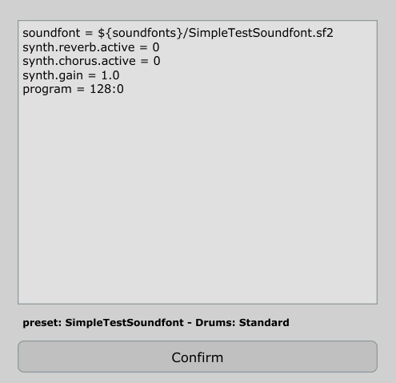

<TABLE CELLSPACING="0" CELLPADDING="0">
  <TR>
    <TH>
      <H1>FluidSynth Plugin for DAWs and Pedantic FluidSynth Command
          Line Processor</H1>
    <TH>
      
    </TH>
  </TR>
</TABLE>

## Overview

_[FluidSynth][]_ is one of the most prominent open source MIDI
players.  It is reasonably flexible, delivers a good audio quality and
is available for the typical platforms.  A common scenario is to use
it for either rendering live MIDI data on some audio device or
converting MIDI files into audio files by command-line batch
processing.

Basis of <TT>FluidSynth</TT> are the so-called *soundfonts*.  Soundfonts
contain sampled instruments together with envelope and modulation
definitions and other descriptive settings.  It is easy to find really
usable ones in the internet and also several of those cover all
general MIDI instruments (for example, the `FluidR3_GM.sf2`).

So when using <TT>FluidSynth</TT> in a command-line driven context all
is well.  But when you want play around with settings for
<TT>FluidSynth</TT> interactively in a DAW, you need some
approximation of the command-line fluidsynth as a DAW plugin rendering
audio from MIDI as close as possible to the original.

There were some previous efforts like Alexey Zhelezov's
_[FluidSynthVST][]_ or Birch Labs' _[JuicySFPlugin][]_, but those are
a bit tricky to use and support for them is unclear.  But the main
point is that even though they rely on the <TT>FluidSynth</TT>
library, they **do not exactly reproduce an external fluidsynth
rendition of some MIDI data**.  Reasons for that will be explained
below.

The reason for being picky about the exact rendering is as follows: my
scenario is a command-line based rendering of notation videos for a
band (the _[LilypondToBandVideoConverter][LTBVC]_).  Part of that
chain is <TT>FluidSynth</TT>, but I want to experiment interactively
with settings in a DAW to optimize the audio and then have a faithful
reproduction of the external rendering pipeline within the DAW.

The first component of this package is a DAW plugin called
<B><TT>FluidSynthPlugin</TT></B>.  It has a simplistic interface where
you specify a soundfont, several fluidsynth settings and possibly a
MIDI program to be selected by putting text data in a text field.
Then you are able to convert an incoming MIDI stream in a DAW to audio
using the FluidSynth library.

When playing around with that plugin some inexplicable differences to
the command-line <TT>FluidSynth</TT> occured.  Even when using
innocent soundfonts (without chorus and other modulators), sample
playback in the plugin and the command-line player were not absolutely
identical.  Analysis and contact with the <TT>FluidSynth</TT> team
revealed that in that program MIDI events are quantized onto some
processing raster in the millisecond range while the plugin quantizes
them onto the smallest time unit: the sample raster itself.

Hence another tool in this package circumvents the rasterization by
the player of <TT>FluidSynth</TT>.  That second component is a
simplistic but pedantic command-line converter called
<B><TT>FluidSynthConverter</TT></B>.  It converts a MIDI file into a
WAV file, is also based on the fluidsynth library and does the same
sample-exact event feeding into that library as the plugin.

When using both components (command-line and DAW) on the same MIDI
data they typically produce audio output with a difference of less
than -200dBFS in a spectrum analysis.

Those components are currently available - as x86_64 versions - for
Windows and Linux as VST3, MacOSX version are in preparation.

All the code is open-source; hence you can check and adapt it to your
needs.

## Installation

The installation is as follows:

   1. Expand the appropriate binary archive of
      <TT>FluidSynthPlugin</TT> for your platform from this
      [repository](./releases) into the directory for VST plugins of
      your DAW.

   2. The distribution also contains a documentation [pdf
      file](./FluidSynthPlugin-documentation.pdf) in subdirectory doc
      and test files in subdirectory test (for details on the
      regression test see below).

   3. When installing the plugins and program on Windows, they require
      the so-called *Microsoft Visual C++ Redistributable* library.
      Very often this is already installed on your system; if not, you
      have to install it from the [Microsoft][VCCLib] site.

   4. Restart your DAW and rescan the plugins.  You should now be
      able to select the <TT>FluidSynthPlugin</TT>.

   5. The command-line version <TT>FluidSynthFileConverter</TT> can be
      put in an arbitrary location for executables.  Ensure that the
      dynamic libraries in its directory are also placed
      appropriately.

## Usage

### FluidSynthPlugin



The above diagram shows the UI for the <TT>FluidSynthPlugin</TT>. It
is very simplistic: a multiline edit field can be used for command
entry. In this multiline field <TT>FluidSynth</TT> commands and some
extension can be written (like e.g. `synth.chorus.active`,
`synth.reverb.level` or `program`). Each command is on a single line
followed by an equal sign and its associated value.

Edits have to be confirmed with the "Confirm"-button and then the
audio output is active.

Note that the plugin listens to all MIDI channels, but is not
multi-timbral (i.e. only a single sound can be produced as specified
by the "program" setting or program changes within the MIDI event
stream).

### FluidSynthFileConverter

The <TT>FluidSynthFileConverter</TT> is merely a functionally reduced
clone of <TT>FluidSynth</TT>, but with a special property: it places
MIDI events onto the raster given by the sample rate (as far as
possible).

Similarly to <TT>FluidSynth</TT>, the <TT>FluidSynthFileConverter</TT>
is a command-line program.  But the converter does not have to do
real-time processing, so the list of its options is reduced, but it is
a subset of the options of <TT>FluidSynth</TT>.  On top of that it
only supports a conversion from a MIDI file into an audio file.

E.g. the command
```
fluidSynthFileConverter -g 1.0 -R 0 test.mid FluidR3_GM.sf2 -F test.wav
```
produces a wave file <TT>test.wav</TT> from MIDI file
<TT>test.mid</TT> using sound font <TT>FluidR3_GM.sf2</TT> with reverb
set to inactive and gain set to unity.

## Testing the Plugin and the Command-Line Processor

The test script <TT>makeTestFiles.bat</TT> or
<TT>makeTestFiles.sh</TT> in the [test](./test) directory assumes that
the <TT>FluidSynthFileConverter</TT> is available in the program
search path.

The test script produces a sound file from a demo MIDI file.

Since there are so many DAWs available, it is hard to provide a test
project for each of those.  The distribution contains a Reaper project
file <TT>testFluidSynthPlugin.rpp</TT> referencing that audio test
file and the originating MIDI file in two tracks.  Adaption to other
DAW should be straightforward.

Ideally (because the result files have inverted phase), everything
should cancel out as shown here:


## Restrictions

### Missing Timelocking Functionality

To handle the situation that the phase of modulators in an external
audio file can be faithfully reproduced in a plugin, one could use a
parameter telling the relative time of the plugin with respect to the
externally rendered audio.  While this method would lead to perfect
reproduction of the external rendering, it is not feasible for the
<TT>FluidSynthPlugin</TT>.  There is no direct way to set the
modulators in the underlying <TT>FluidSynth</TT> library to a specific
phase.  As a workaround when one could reset all modulators at
playback start and first silently have the synthesizer process samples
for some duration to bring its modulators to the correct phases before
then putting out the "real" samples. But this is tedious, takes a lot
of processing time and also does not solve the problem of having the
playback starting before the fragment start time.

When you need a bit-exact reproduction of externally rendered audio by
the <TT>FluidSynthPlugin</TT>, some workaround has to be made as
follows:

  - The selected instrument(s) in the soundfont must not contain
    any (free-running) modulators.

  - Chorus must be deactivated (e.g. by setting
    `synth.chorus.active` to 0).

### Forced Rasterization by <TT>FluidSynth</TT>

As mentioned in the introduction the important difference between
using the standard <TT>FluidSynth</TT> from the command-line versus
from a DAW is that there is a forced rasterization to 64 samples'
intervals.

Unfortunately this rasterization is not just done by
<TT>FluidSynth</TT> when communicating with audio drivers or its file
renderer, but also done internally by the fluidsynth synthesizer in
the library.  The length of the smallest unit for which
<TT>FluidSynth</TT> can make state changes and does buffering is a
constant called `FLUID_BUFSIZE` and this is fixed to the value 64.

 - One could recompile the <TT>FluidSynth</TT> library and set this
   value to 1 but this would lead to a performance penalty and I
   wanted to rely on stock versions of <TT>FluidSynth</TT>.

 - Some intelligent buffering to adapt the rasters could be done, but
   this also did not work out well since the <TT>FluidSynth</TT>
   library cannot cope with resetting the synthesizer or flushing its
   data

As a workaround a script can help, when your DAW allows to change the
loop interval and also the play head position via its API.  As an
example a Lua script is provided for the Reaper DAW for demonstration
purposes.

## Details

A more thorough discussion can be found in the detailed user manual
*[here](./FluidSynthPlugin-documentation.pdf)*.

## Acknowledgements

This project is a derivative work based on the foundations laid by the
FluidSynth community.

My thanks go to the FluidSynth team: Peter Hanappe, Conrad Berhörster,
Antoine Schmitt, Pedro López-Cabanillas, Josh Green, David Henningsson
and Tom Moebert.  Without your effort this would not have been
possible!

[FluidSynth]: https://www.fluidsynth.org
[FluidSynthVST]: https://github.com/AZSlow3/FluidSynthVST
[JUCE]: http://www.juce.com/
[JuicySFPlugin]: https://github.com/Birch-san/juicysfplugin
[LTBVC]: https://github.com/prof-spock/LilypondToBandVideoConverter
[VCCLib]: https://learn.microsoft.com/cpp/windows/latest-supported-vc-redist
